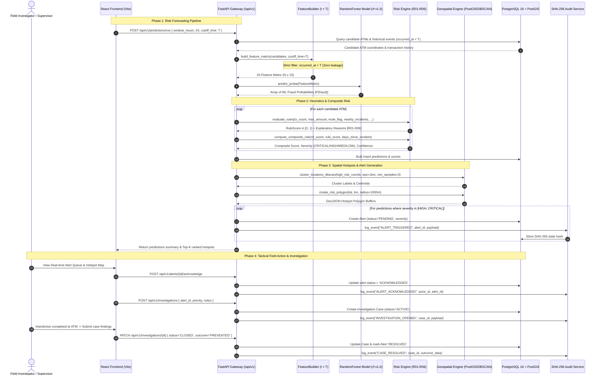
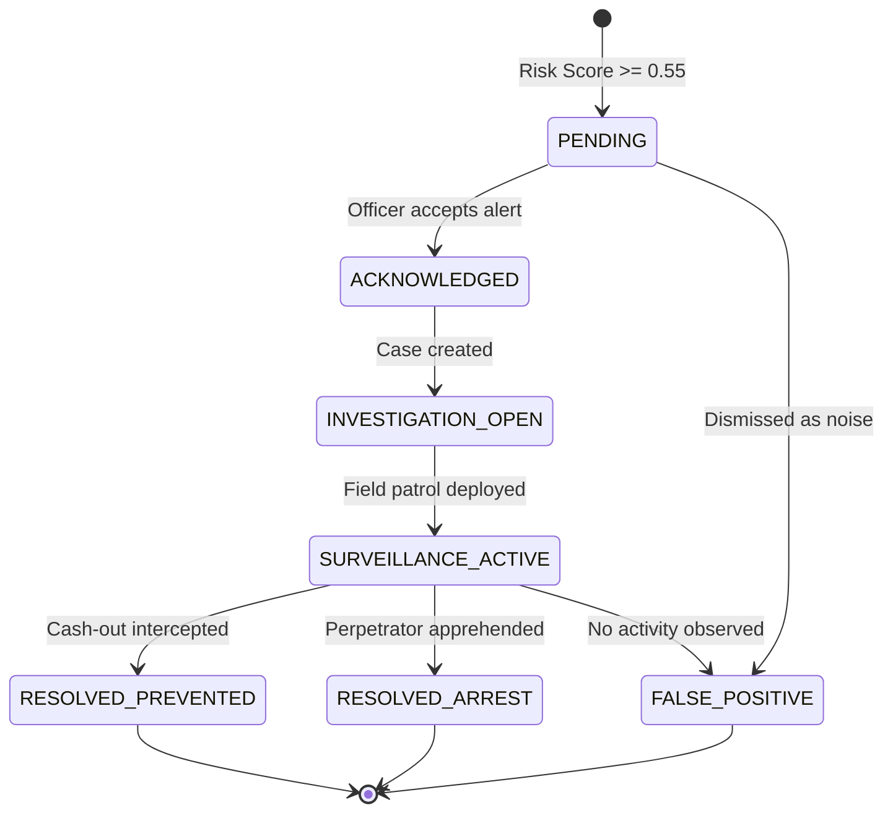

# PravahDridh — System Workflow Specification
> **Smart India Hackathon · Problem Statement 26184**  
> **Platform**: Heuristic Engine for Risk Mapping and Early-warning of Suspicious activity

---

## 1. Executive Workflow Summary

The operational lifecycle of **PravahDridh** is built on the tactical closed-loop paradigm:

```
Predict ──► Prioritize ──► Explain ──► Alert ──► Act ──► Audit ──► Learn
```

This ensures raw transactional feeds and cybercrime incident data are transformed into real-time preventative intelligence, actionable field dispatches, and immutable post-incident audit trails.

---

## 2. End-to-End System Sequence

The following sequence diagram models the end-to-end data and decision flow across all tiers of PravahDridh:



---

## 3. Detailed Step-by-Step Workflow Phases

### Phase 1: Data Ingestion & Geospatial Normalization
1. **Complaint & Incident Intake**:
   - Cybercrime complaints ingested from citizen portals (1930 / NCRP), bank suspicious activity reports (SARs), and victim FIRs.
   - Address strings geocoded into PostGIS coordinates `POINT(lon, lat)` with SRID 4326.
2. **Financial Signal Sanitization**:
   - Bank transactions linked to complaint reference numbers.
   - PII protection: Account numbers converted to irreversible SHA-256 hashes (`source_account_hash`, `destination_account_hash`).
   - Channel classification tagged (`ATM_WITHDRAWAL`, `UPI_TRANSFER`, `IMPS_CASHOUT`).

### Phase 2: Feature Engineering with Zero Temporal Leakage
1. **Anchor Timestamp Selection ($T$)**:
   - The user or scheduler specifies an operational cutoff timestamp $T$ (e.g., current production time).
2. **Strict Filtering ($t < T$)**:
   - To prevent future data contamination, all window aggregations strictly select transactions satisfying:
     $$\text{occurred\_at} \ge T - \Delta t \quad \text{AND} \quad \text{occurred\_at} < T$$
3. **15-Dimensional Feature Matrix Generation**:
   - **Temporal**: `hour_of_day`, `day_of_week`, `is_weekend`.
   - **Velocity**: `recent_activity_count_24h`, `recent_activity_count_7d`.
   - **Financial**: `recent_amount_24h`, `max_single_amount_24h`, `amount_log_24h`.
   - **Spatial**: `historical_incident_count_500m`, `historical_incident_count_2km`, `atm_density_1km`.
   - **Network & History**: `historical_cashout_count_30d`, `connected_mule_accounts_count`, `unique_accounts_24h`, `hours_since_last_activity`.

### Phase 3: Machine Learning Model Inference
1. **Candidate ATM Retrieval**:
   - Active ATMs within the operational jurisdiction (e.g., target city or police district) are fetched.
2. **Batch Inference**:
   - The $(N \times 15)$ matrix is passed to `RandomForestClassifier.predict_proba()`.
   - Extracts positive class probability $P(\text{fraud} \mid \mathbf{x}) \in [0.0, 1.0]$.
3. **Local Explainability**:
   - Tree feature contributions computed to identify the top 3 contributing factors for every candidate.

### Phase 4: Heuristic Rules Evaluation & Composite Risk Scoring
1. **Deterministic Rule Checks (R01–R06)**:
   - Evaluates whether specific fraud patterns are present:
     - **R01**: Transacting count $>5$ within 2km in 24 hours ($+0.25$).
     - **R02**: Max single transfer $\ge ₹50,000$ ($+0.15$).
     - **R03**: Flagged mule account detected in transaction chain ($+0.30$).
     - **R04**: $\ge 3$ historical incidents within 500m ($+0.20$).
     - **R05**: Modus operandi & category pattern match ($+0.10$).
     - **R06**: Weekend or late-night withdrawal window ($+0.10$).
   - Computes normalized rule score: $\text{RuleScore} = \min\left(\sum \text{rules}, 1.0\right)$.
2. **Composite Risk Formulation**:
   $$\text{Final Score} = 0.60 \times P(\text{ML}) + 0.30 \times \text{RuleScore} + 0.10 \times e^{-0.05 \times \Delta t_{\text{days}}}$$
3. **Severity Tier Assignment**:
   - `CRITICAL` ($0.75 - 1.00$): Highest priority; activates immediate sound/visual warnings.
   - `HIGH` ($0.55 - 0.74$): Generates high-priority dispatch alerts.
   - `MEDIUM` ($0.30 - 0.54$): Displayed on watchlists; regular patrol check.
   - `LOW` ($0.00 - 0.29$): Normal baseline; monitored passively.

### Phase 5: Geospatial Clustering & Hotspot Polygon Generation
1. **DBSCAN Density Clustering**:
   - Extracts coordinates of ATMs flagged with `HIGH` or `CRITICAL` risk.
   - Converts coordinates to radians and executes DBSCAN using Haversine distance ($\epsilon = 1.0\text{ km}$, $\text{min\_samples} = 3$).
   - Identifies co-located cash-out clusters (e.g., bank rows, commercial centers).
2. **GeoJSON Hotspot Synthesis**:
   - For cluster centroids and individual high-risk ATMs, `GeospatialService.create_risk_polygon()` generates a 24-vertex circular buffer ($1000\text{m}$ radius).
   - Bundles output as a GeoJSON `FeatureCollection` for native rendering on Leaflet maps.

### Phase 6: Alert Dispatch & Case Investigation Lifecycle
1. **Automated Alert Generation**:
   - Every prediction scoring $\ge 0.55$ automatically spawns an entry in `alerts` table with status `PENDING`.
2. **Alert Triaging**:
   - Supervisors view the live priority queue, review SHAP explanation reasons, and assign the alert to a Field Investigator.
3. **Field Investigation**:
   - Field Investigator acknowledges the alert via mobile or desktop console (`ACKNOWLEDGED`).
   - If suspicious activity is confirmed on-site or via CCTV surveillance, an Investigation Case is opened (`ACTIVE`).
   - Investigator logs field notes, suspect descriptions, and vehicle numbers.
4. **Resolution**:
   - The case is closed with an outcome flag (`PREVENTED`, `ARREST_MADE`, or `FALSE_POSITIVE`).



### Phase 7: Tamper-Evident Cryptographic Audit Trail
1. **Event Capture**:
   - Every state transition (prediction run, alert assignment, case resolution) triggers `AuditService.log_event()`.
2. **State Hashing**:
   - Generates SHA-256 digest:
     $$\text{Hash} = \text{SHA-256}(\text{actor\_id} : \text{event\_type} : \text{resource\_type} : \text{resource\_id} : \text{timestamp} : \text{payload\_json})$$
3. **Forensic Verification**:
   - Supervisors can audit any past decision; any modification to historical rows causes hash mismatch detection.

### Phase 8: Feedback Loop & Continuous Model Learning
1. **Ground Truth Label Collection**:
   - Ground truth labels ($y = 1$ if cash-out occurred, $y = 0$ otherwise) are updated from closed cases and bank chargeback reports.
2. **Model Evaluation & Comparison**:
   - ML engineers execute offline training (`python -m app.ml.trainer`) on newly accumulated time slices.
   - Evaluates PR-AUC, Precision@10, Precision@20, and Brier score against baseline `rf-v1.0`.
3. **Model Promotion**:
   - If the candidate model exceeds production thresholds, `POST /api/v1/models/{id}/promote` promotes it to production with zero server downtime.

---

## 4. Error Handling & Fallback Workflows

| Fault Condition | System Reaction | Fallback Workflow |
|---|---|---|
| **ML Model Artifact Missing** | `FileNotFoundError` caught during inference | Risk Engine falls back to **Rule-Only Mode** ($W_{\text{rule}} = 0.90$, $W_{\text{decay}} = 0.10$); alerts logged to Admin. |
| **PostGIS Spatial Disconnect** | Database timeout on spatial query | System executes in-memory Haversine calculations (`geospatial_service.haversine_distance_km`). |
| **Redis Cache Unavailability** | Connection refused | FastAPI bypasses session cache and executes direct database query without interrupting request flow. |
| **Sparse Data (< 3 records)** | DBSCAN minimum sample not met | DBSCAN marks all points as noise (`-1`); individual radius circles rendered instead of clusters. |

---

*Smart India Hackathon 2026 · Problem Statement 26184 · Team PravahDridh*
