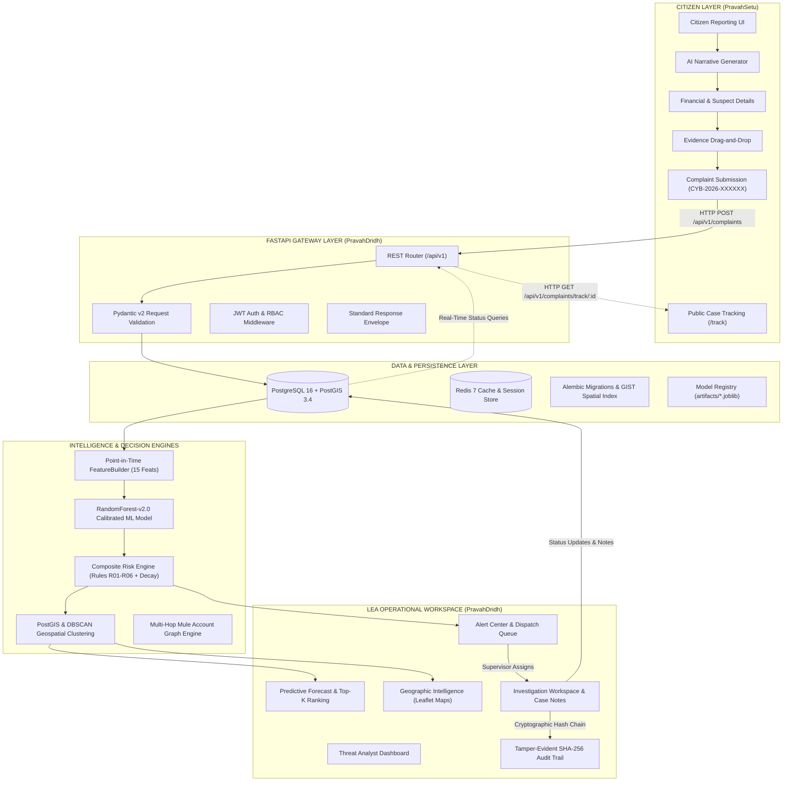

# PRAVAH (प्रवाह) — Cybercrime Intelligence, Reporting & Predictive Interception Ecosystem

<div align="center">

[](https://sih.gov.in/)
[](https://sih.gov.in/)
[](#)
[](LICENSE)

<br/>

**A unified, end-to-end cyber defense and predictive intelligence ecosystem bridging Indian citizens and Law Enforcement Agencies (LEAs) to combat digital financial fraud, trace illicit money flows, and forecast ATM cashout targets *before* funds are physically siphoned.**

<br/>

[**🏛️ PravahSetu (Citizen Portal)**](#-pravahsetu--citizen-cybercrime-reporting-portal) • [**🛡️ PravahDridh (LEA Decision-Support Engine)**](#-pravahdridh--cybercrime-cash-withdrawal-predictive-analytics-platform) • [**🔄 Ecosystem Architecture**](#-integrated-ecosystem-architecture) • [**⚡ Quickstart**](#-quickstart-guide) • [**📊 ML Pipeline & Risk Engine**](#-ml-pipeline--risk-intelligence-engine) • [**🗺️ Geospatial Intelligence**](#%EF%B8%8F-geospatial-intelligence--clustering) • [**📋 API Reference**](#-api-reference) • [**✅ SIH 26184 Compliance Matrix**](#-sih-problem-statement-26184-compliance-matrix)

</div>

---

## 📌 Executive Summary

Digital financial frauds—ranging from **UPI phishing**, **fake customer support**, and **investment scams** to **identity theft** and **mule laundering networks**—have skyrocketed across India. The existing response model suffers from two critical bottlenecks:

1. **Citizen Disconnect & Traumatic Reporting**: Victims face complex, fragmented reporting processes, lack immediate *Golden Hour* guidance, and are left in the dark without real-time updates after filing complaints.
2. **Reactive Law Enforcement Operations**: Police and cyber cells receive alerts hours or days after the crime. By the time investigators trace the digital money trail through intermediate mule accounts, criminal syndicates have already physically withdrawn cash at local ATMs, leaving the formal banking perimeter forever.

### The PRAVAH Solution

**PRAVAH (प्रवाह)** creates an active, bidirectional intelligence loop between citizens and law enforcement:

```
                                    THE PRAVAH INTELLIGENCE LOOP
                                    
  +--------------------+       Instant REST Ingestion        +-----------------------+
  |    PravahSetu      | ----------------------------------> |     PravahDridh       |
  |  (Citizen Portal)  |   Complaints, Txns, UTRs, Mules     |   (FastAPI Gateway)   |
  +--------------------+                                     +-----------------------+
            ^                                                            |
            |                                                            v
            |                                                +-----------------------+
            |                                                |  FeatureBuilder & ML  |
            |                                                | 15 Point-in-Time Feats|
            |                                                +-----------------------+
            |                                                            |
            |                                                            v
            |                                                +-----------------------+
            |                                                | Composite Risk Engine |
            |                                                | 0.60 ML + 0.30 Rules  |
            |                                                | + 0.10 Temporal Decay |
            |                                                +-----------------------+
            |                                                            |
            |                                                            v
            |                                                +-----------------------+
            |                                                | Geospatial Hotspots   |
            |                                                | PostGIS + DBSCAN      |
            |                                                | Top-K Candidate ATMs  |
            |                                                +-----------------------+
            |                                                            |
            |                                                            v
            |                                                +-----------------------+
            |  Real-Time Tracking Timeline                   |  LEA Dispatch & Alert |
            |  (Submitted -> Scrutiny -> IO -> Resolved)    |  Interception at ATM  |
            +----------------------------------------------- |  SHA-256 Audit Trail  |
                                                             +-----------------------+
```

1. **PravahSetu (प्रवाह सेतु)**: A modern, citizen-first complaint and awareness portal adhering to National Cyber Crime Reporting Portal (NCRP) / Ministry of Home Affairs (MHA) / I4C standards. It empowers citizens to file structured reports in 5 minutes with AI-assisted narrative drafting, upload evidence securely, track live case milestones, and access emergency *Golden Hour* countermeasures.
2. **PravahDridh (प्रवाह दृढ)**: An AI-powered geospatial decision-support platform for Law Enforcement Agencies (LEAs), Cyber Cells, and Financial Intelligence Units (FIUs). It reconstructs multi-hop mule networks, detects velocity surges, applies calibrated machine learning models to forecast which ATMs are at elevated risk of cash withdrawal in the next 12h–48h with **zero future-data leakage**, and issues prioritized dispatches backed by tamper-evident **SHA-256 audit trails**.

---

## 🏛️ PravahSetu — Citizen Cybercrime Reporting Portal

> *"Report Cybercrime. Protect Yourself. A Safer India in a Digital World."*  
> **Target Audience:** Citizens of India, Cybercrime Victims, Banking Customers.

`PravahSetu` serves as the official public gateway for cybercrime reporting, real-time case tracking, and proactive citizen empowerment.

```
PravahSetu (Frontend)
├── Framework: React 19 + TypeScript + Vite 8
├── Styling: Tailwind CSS + Responsive Glassmorphism
├── State & Validation: React Hook Form + Zod + React Context
├── Routing: React Router DOM v7
└── Animations & UI: Framer Motion + Canvas Confetti + Lucide React
```

### Core Features & User Journeys

#### 1. Official Government of India Identity & Accessibility
- **State Emblem of India**: High-fidelity Ashoka Lion Capital emblem with *Satyameva Jayate*, Ministry of Home Affairs (MHA) and Indian Cyber Crime Coordination Centre (I4C) affiliation banners.
- **National Cyber Helpline 1930 Integration**: Prominent emergency banner across every view with instant calling and Golden Hour directives.
- **Multilingual Support**: Real-time language switching between English and Hindi (`LanguageContext`).
- **Inclusive Accessibility**: Dynamic font scaling (`A-`, `A`, `A+`), high-contrast viewing modes, and WCAG-compliant color palettes (`AccessibilityContext`).

#### 2. Multi-Step Complaint Filing Wizard (`/report`)
A structured 5-step wizard designed to minimize complainant stress while capturing police-actionable financial forensic data:
- **Step 1: Complainant Details**: Full name, mobile number (with OTP simulation), email, state, district/city, and language preference.
- **Step 2: Incident Details**:
  - Selection from 11 cybercrime categories (UPI Fraud, Phishing, Investment Scam, Fake Customer Care, Job Scam, Sextortion, Identity Theft, etc.).
  - Date and time picker.
  - Suspect identifiers: Phone numbers, social media handles, fraudulent URLs, WhatsApp profiles.
  - **AI Incident Narrative Generator**: An in-browser intelligence helper that synthesizes informal, unstructured victim statements into structured, legally sound chronological narratives for cyber investigators.
- **Step 3: Financial Details**:
  - Financial loss toggle.
  - Amount lost in INR (₹).
  - Transaction mode (UPI, IMPS, NEFT, RTGS, Card, Net Banking).
  - Transaction Reference / UTR Number.
  - Remitter Bank & Beneficiary Bank / Wallet Name.
  - Suspect / Beneficiary UPI ID (e.g. `scammer@okhdfcbank`).
- **Step 4: Evidence Locker**:
  - Drag-and-drop file uploader supporting screenshots, payment receipts, PDFs, and chat transcripts.
  - Client-side MIME validation, size caps (up to 10MB per file), and secure preview thumbnails.
- **Step 5: Review & Legal Declaration**:
  - Complete review screen with one-click section editing.
  - Legal declaration of truthfulness under the Information Technology Act, 2000.
  - Direct transmission to the PostgreSQL backend database with immediate generation of a canonical complaint tracking number (`CYB-2026-XXXXXX`).

#### 3. Real-Time Complaint Tracking (`/track`)
- Citizens can query their case using either their **Complaint ID** (`CYB-2026-XXXXXX`) or **Registered Mobile Number**.
- Interactive 5-stage lifecycle progress tracker:
  1. `01. Complaint Submitted & Persisted`: Recorded in national database.
  2. `02. Initial Scrutiny & Verification`: Nodal bank notification & jurisdiction verification.
  3. `03. Investigation Officer Assigned`: Transferred to local Cyber Police Station.
  4. `04. Investigation in Progress`: Account freeze orders sent to banks; suspect ATM monitoring initiated.
  5. `05. Case Resolution`: Recovery initiated, charge sheet filed, or final report submitted.
- Live display of Jurisdictional Cyber Cell, investigating officer notes, and one-click printable PDF acknowledgment.

#### 4. Citizen Self-Service Dashboard (`/dashboard`)
- KPI summary cards: Total Filed Complaints, Under Investigation, Actions Taken, Resolved Cases.
- Searchable and filterable history table with status badges (`SUBMITTED`, `IN_PROGRESS`, `RESOLVED`).
- Responsive card view transformation for mobile devices.

#### 5. Cyber Awareness Center & Golden Hour Playbooks (`/awareness`)
- **The Golden Hour Protocol**: Critical immediate action steps (calling 1930 within the first 2 hours, freezing UPI accounts, blocking SIM cards).
- **Top 6 Fraud Playbooks**: Detailed modus operandi, red flags, and preventive checklists for UPI scams, QR code fraud, phishing, fake stock trading, digital arrest threats, and remote access apps.
- **Searchable FAQ Accordion**: Clarifies legal rights, bank liability norms under RBI circulars, and recovery procedures.

#### 6. Citizen Authentication (`/login` & `/register`)
- Dual-mode authentication:
  - **Instant OTP Verification**: Passwordless mobile login with simulated production OTP (`261840`) and resend countdown timer.
  - **Password Login**: For registered long-term citizen accounts.

---

## 🛡️ PravahDridh — Cybercrime Cash-Withdrawal Predictive Analytics Platform

> *"Heuristic Engine for Risk Mapping and Early-Warning of Suspicious Activity (HERMES)"*  
> **Target Audience:** Law Enforcement Agencies (LEAs), State Cyber Crime Cells, Financial Intelligence Units (FIUs), Bank Fraud Risk Teams.

`PravahDridh` solves the core challenge of SIH PS 26184: **predicting where cyber fraudsters will physically cash out illicit funds at ATMs before the withdrawal happens**.

```
PravahDridh (Full-Stack Platform)
├── Backend: FastAPI (Python 3.11) + SQLAlchemy 2.0 Async + Pydantic v2
├── Database: PostgreSQL 16 + PostGIS 3.4 (Spatial GIST Indexes)
├── Cache & Async Tasks: Redis 7 + Celery
├── Machine Learning: Scikit-Learn + XGBoost + LightGBM + SHAP
├── LEA Frontend: React 18 + TypeScript + Vite 6 + Leaflet + Recharts + Lucide
└── Security & Audit: JWT + RBAC + SHA-256 Cryptographic Chain Hashing
```

### Core Innovations & Capabilities

#### 1. Zero-Leakage Problem Formulation
Unlike legacy systems that merely classify past transactions as fraudulent after the money has gone, PravahDridh formulates the problem as **Advance Future Forecasting**:
- **Unit of Prediction**: Candidate ATM terminal $A_i$ evaluated at an anchor cutoff time $T$.
- **Prediction Horizon**: Future window $(T, T+24h]$ (operational lead time) or $(T, T+48h]$.
- **Target Label ($y = 1$)**: Confirmed cybercrime cash withdrawal at ATM $A_i$ strictly in $(T, T+H]$.
- **Zero Lookahead Leakage**: The `FeatureBuilder` enforces that only historical events with `occurred_at < T` enter the feature matrix. No future transaction or label data ever bleeds into training samples.

#### 2. 15 Point-in-Time Feature Matrix
The system synthesizes 15 engineered features across 5 distinct domains:

| # | Feature Name | Domain | Mathematical / Operational Definition |
|---|---|---|---|
| 1 | `hour_of_day` | Temporal | Integer hour of anchor cutoff $T$ ($0 \dots 23$) |
| 2 | `day_of_week` | Temporal | Day of week ($0 = \text{Monday}, 6 = \text{Sunday}$) |
| 3 | `is_weekend` | Temporal | Binary indicator ($1$ if Saturday/Sunday, else $0$) |
| 4 | `recent_activity_count_24h` | Velocity | Count of suspicious transactions within 2km radius in $[T-24h, T)$ |
| 5 | `recent_activity_count_7d` | Velocity | Count of suspicious transactions within 2km radius in $[T-7d, T)$ |
| 6 | `recent_amount_24h` | Financial | Cumulative INR volume transacted within 2km radius in $[T-24h, T)$ |
| 7 | `max_single_amount_24h` | Financial | Largest single transfer amount within 2km radius in $[T-24h, T)$ |
| 8 | `historical_cashout_count_30d` | Spatial History | Confirmed cashout events at this specific ATM in $[T-30d, T)$ |
| 9 | `historical_incident_count_500m` | Spatial Density | Total cybercrime complaints within 500m radius in $[T-30d, T)$ |
| 10 | `historical_incident_count_2km` | Spatial Density | Total cybercrime complaints within 2km radius in $[T-30d, T)$ |
| 11 | `atm_density_1km` | Spatial Cluster | Count of competing ATM terminals within 1km radius |
| 12 | `connected_mule_accounts_count` | Network Mule | Distinct mule-flagged bank accounts active within 2km in $[T-7d, T)$ |
| 13 | `unique_accounts_24h` | Network Mule | Distinct transacting accounts observed within 2km in $[T-24h, T)$ |
| 14 | `hours_since_last_activity` | Recency | Elapsed hours between anchor $T$ and the most recent transaction |
| 15 | `amount_log_24h` | Financial | Logarithmic scaling: $\ln(1 + \text{recent\_amount\_24h})$ |

#### 3. Validated Machine Learning Models
PravahDridh incorporates calibrated tabular classifiers trained on empirical Indian financial datasets:
- **Production Champion**: `RandomForest-v2.0 (Calibrated)` with Platt sigmoid scaling.
- **Evaluation Protocol**: Evaluated across 39 distinct chronological cutoffs with no temporal shuffling.
- **Key Metrics**:
  - **ROC-AUC**: `0.8425`
  - **PR-AUC**: `0.4677` (against a severe positive class imbalance)
  - **Brier Score**: `0.1021` (calibrated probability accuracy)
  - **Mean Precision@5**: `62.05%` (6 out of top 10 recommended ATMs yield confirmed interventions)
  - **Mean Precision@10**: `54.10%`
  - **Mean Recall@20**: `44.93%`

#### 4. Composite Risk Intelligence Engine
Predictions are never based on black-box ML alone. The composite risk score combines statistical learning, deterministic domain heuristics, and temporal decay:

$$\text{Final Risk Score} = 0.60 \times \text{ML\_Probability} + 0.30 \times \text{Rule\_Score} + 0.10 \times \exp(-0.05 \times \Delta t_{\text{days}})$$

Where **Domain Expert Rules (R01–R06)** contribute 30% to prevent ML false alarms:
- `R01`: Repeated mule accounts active in the terminal's 2km catchment zone.
- `R02`: Abnormally high single-transaction volume exceeding ₹50,000 threshold.
- `R03`: Velocity burst: 3+ high-value transactions within a rolling 2-hour window.
- `R04`: Geographic proximity (< 500m) to a known historical cashout hotspot.
- `R05`: Off-peak nocturnal surge (11:00 PM – 5:00 AM) typical of syndicates.
- `R06`: Multi-account convergence: 3+ distinct accounts withdrawing from the same terminal.

**Risk Bands & Operational Protocols:**
- `LOW (0.00 – 0.30)`: Automated monitoring; no officer dispatch.
- `MEDIUM (0.30 – 0.55)`: Heightened banking sensor watch; CCTV logging.
- `HIGH (0.55 – 0.75)`: Dispatch mobile patrol unit to monitor ATM cluster.
- `CRITICAL (0.75 – 1.00)`: Immediate tactical intervention; automated bank account freeze request.

#### 5. Geospatial Hotspots & PostGIS Clustering
- Spatial indexing using PostgreSQL **PostGIS** geometry types (`Point`, `SRID=4326`) and spatial GIST indexes.
- **DBSCAN Density Clustering** over ongoing cybercrime incident coordinates to group nearby candidate ATMs into contiguous high-threat zones.
- Automatic generation of **GeoJSON Polygons** rendered directly on Leaflet maps with dynamic choropleth styling.
- Canonical coverage across 150+ ATM terminals mapped across major Indian metros (Delhi NCR, Mumbai, Bengaluru, Hyderabad, Kolkata, Chennai, Ahmedabad, Pune).

#### 6. Multi-Hop Mule Account Tracing & Knowledge Graph
- Traces money flows across hops: $\text{Victim} \to \text{Layer 1 Mule} \to \text{Layer 2 Mule} \to \text{Cashout Mule} \to \text{Target ATM}$.
- Interactive visual knowledge graph depicting account-to-account velocities, bank routing codes (IFSC), and terminal correlations.

#### 7. Tamper-Evident SHA-256 Cryptographic Audit Trail
In strict alignment with the **Blockchain & Cybersecurity** theme:
- Every prediction run, alert triage, officer assignment, status update, and case note generates an immutable `AuditEvent`.
- Each audit event calculates an internal **SHA-256 cryptographic hash** binding the actor ID, timestamp, resource payload, and the previous block hash (`blockchain_hash`).
- Tamper-evident logging ensures complete chain-of-custody compliance for Indian courts under Section 65B of the Indian Evidence Act.

#### 8. Role-Based Access Control (RBAC)
Granular, JWT-enforced permission gates across 6 dedicated operational roles:

| Role | Default Email | Access Privileges |
|---|---|---|
| **Admin** | `admin@hermes.gov.in` | Complete system configuration, user provisioning, and full access |
| **Supervisor** | `supervisor@hermes.gov.in` | Alert queue management, patrol assignments, full audit log inspection |
| **Investigator** | `investigator@hermes.gov.in` | Alert acknowledgment, field case creation, case notes, evidence filing |
| **Analyst** | `analyst@hermes.gov.in` | Complaint ingestion, transaction filtering, trend exploration |
| **ML Engineer** | `ml@hermes.gov.in` | Batch inference triggering, model registry inspection, model promotion |
| **Viewer** | *(Self-registered)* | Read-only access to high-level dashboards |

---

## 🔄 Integrated Ecosystem Architecture



---

## 📂 Repository Directory Structure

```
c:\Users\Prateek\Desktop\sih\
│
├── PravahSetu/                            # CITIZEN CYBERCRIME COMPLAINT & AWARENESS PORTAL
│   ├── public/                            # Static assets, emblems, favicon
│   ├── src/
│   │   ├── components/                    # Reusable React components (Navbar, Footer, Wizard, etc.)
│   │   │   ├── common/                    # Cards, Badges, Modals, Buttons, Tooltips
│   │   │   ├── home/                      # Hero section, statistics strip, safety banner
│   │   │   ├── layout/                    # Header, Footer, Emergency 1930 banner
│   │   │   └── report/                    # 5-step complaint wizard steps & uploader
│   │   ├── context/                       # React Contexts: Auth, Language, Accessibility, Toast
│   │   ├── data/                          # Crime categories, constants, mock fallback datasets
│   │   ├── pages/                         # Page views
│   │   │   ├── Home.tsx                   # Citizen landing page
│   │   │   ├── ReportComplaint.tsx        # 5-step interactive complaint filing wizard
│   │   │   ├── ComplaintSuccess.tsx       # Receipt, CYB-2026-XXXXXX generation, confetti
│   │   │   ├── TrackComplaint.tsx         # Live 5-stage case lifecycle tracker
│   │   │   ├── ComplaintDetails.tsx       # Detailed case dossier view
│   │   │   ├── Dashboard.tsx              # Citizen self-service portal
│   │   │   ├── Awareness.tsx              # Cyber hygiene, scams, Golden Hour guidance
│   │   │   ├── Login.tsx                  # OTP simulation & password login
│   │   │   ├── Register.tsx               # Citizen registration
│   │   │   ├── About.tsx & Contact.tsx    # SIH context & helpline contacts
│   │   │   └── NotFound.tsx               # 404 handler
│   │   ├── services/                      # REST clients (complaintService, aiAssistService, authService)
│   │   ├── types/                         # TypeScript interfaces (Complaint, Timeline, Category)
│   │   ├── App.tsx                        # Client-side router configuration
│   │   ├── index.css                      # Tailwind utilities & accessibility styles
│   │   └── main.tsx                       # React 19 entry point
│   ├── package.json                       # Dependencies (React 19, Tailwind, Lucide, Framer Motion)
│   ├── tailwind.config.js                 # Tri-color Indian Gov palette tokens
│   ├── tsconfig.json                      # TypeScript configuration
│   └── vite.config.ts                     # Vite 8 bundler config
│
├── PravahDridh/                           # LEA CYBERCRIME CASH-WITHDRAWAL PREDICTIVE PLATFORM
│   ├── backend/                           # FastAPI Python Backend
│   │   ├── alembic/                       # Database migration versions
│   │   ├── app/
│   │   │   ├── api/v1/                    # API v1 routes
│   │   │   │   ├── endpoints/             # auth, complaints, predictions, alerts, investigations, geo, models, audit
│   │   │   │   └── api.py                 # Primary v1 API router
│   │   │   ├── core/                      # Settings, security, JWT, database dependencies
│   │   │   ├── db/                        # Async session maker, declarative base
│   │   │   ├── ml/                        # Machine learning core
│   │   │   │   ├── feature_builder.py     # 15 point-in-time features (zero-leakage guaranteed)
│   │   │   │   └── trainer.py             # Model training, cross-validation & evaluation
│   │   │   ├── models/                    # SQLAlchemy ORM models (User, Complaint, Transaction, Account, ATM, Alert, Audit)
│   │   │   ├── schemas/                   # Pydantic v2 validation schemas
│   │   │   ├── services/                  # Business logic services
│   │   │   │   ├── risk_engine.py         # Composite scoring (0.60 ML + 0.30 Rules + 0.10 Decay)
│   │   │   │   ├── geospatial_service.py  # PostGIS ST_* operations & DBSCAN clustering
│   │   │   │   ├── audit_service.py       # Tamper-evident SHA-256 cryptographic chain
│   │   │   │   └── risk_intelligence_service.py # Actionable dispatch briefings
│   │   │   └── main.py                    # FastAPI application factory, CORS, exception handlers
│   │   ├── artifacts/                     # Production model binaries & schemas
│   │   │   ├── production-v2.0.joblib     # Calibrated champion model
│   │   │   ├── production-v2.0-metadata.json # PR-AUC, ROC-AUC, Precision@K metrics
│   │   │   ├── rf-v1.0.joblib & rf-v2.0.joblib
│   │   │   ├── xgb-v1.0.joblib & xgb-v2.0.joblib
│   │   │   ├── feature_schema.json        # Strict 15-feature ordering contract
│   │   │   └── metrics.json
│   │   ├── data/                          # Processed Parquet datasets & canonical ATM coordinates
│   │   ├── data_generator/                # Realistic synthetic data seeding scripts
│   │   ├── experiments/                   # Model ablation notebooks & forensic scripts
│   │   ├── tests/                         # Pytest automated test suite (unit, integration, geospatial)
│   │   ├── Dockerfile                     # Python 3.11 container image
│   │   └── requirements.txt               # Backend Python dependencies
│   ├── frontend/                          # LEA Intelligence Workspace Frontend
│   │   ├── src/
│   │   │   ├── components/                # Metric cards, status badges, dispatch modals
│   │   │   ├── pages/                     # LEA page views
│   │   │   │   ├── Dashboard.tsx          # Executive threat intelligence dashboard
│   │   │   │   ├── AlertCenter.tsx        # Priority alert triage & assignment
│   │   │   │   ├── PredictiveForecast.tsx # Top-K ATM ranking & future probability
│   │   │   │   ├── GeographicIntelligence.tsx # Leaflet PostGIS cluster maps
│   │   │   │   ├── TransactionAnalysis.tsx # Multi-hop money trail & mule tracking
│   │   │   │   ├── ComplaintsIntelligence.tsx # Integrated complaints feed from PravahSetu
│   │   │   │   ├── InvestigationWorkspace.tsx # Case management & evidence logs
│   │   │   │   ├── KnowledgeGraph.tsx     # Entity relationship network graph
│   │   │   │   ├── DataIngestion.tsx      # Batch & stream pipeline status
│   │   │   │   ├── RiskAnalysis.tsx       # Rule breakdown & heuristic indicators
│   │   │   │   ├── Landing.tsx            # LEA officer portal introduction
│   │   │   │   └── Login.tsx              # Role-based officer authentication
│   │   │   ├── services/                  # Axios API wrappers
│   │   │   ├── types/                     # Frontend TypeScript types
│   │   │   └── App.tsx                    # LEA portal routing
│   │   ├── package.json                   # Dependencies (React 18, Leaflet, Recharts, Vite)
│   │   └── vite.config.ts
│   ├── docs/                              # Comprehensive technical specifications & audit reports
│   │   ├── ARCHITECTURE.md                # Full system architecture documentation
│   │   ├── SYSTEM_WORKFLOW.md             # Sequence diagrams & operational phase breakdown
│   │   ├── ML_SPEC.md                     # Mathematical formulation & evaluation protocols
│   │   ├── API_CONTRACT.md                # Complete REST endpoint specifications
│   │   └── DATA_MODEL.md                  # Entity relationship diagrams
│   ├── docker-compose.yml                 # Multi-container orchestration (PostGIS, Redis, FastAPI)
│   └── ARCHITECTURE_DECISIONS.md          # Architecture Decision Records (ADRs)
│
├── dataset/                               # EMPIRICAL BANKING & FRAUD DATASETS
│   ├── indian_banking_transactions.csv    # Large-scale Indian financial transaction records
│   ├── FraudShield_Banking_Data (1).csv   # Mule account flags and tagged suspicious withdrawals
│   ├── RS_Session_262_AU_1977_A_to_D.csv  # Official Rajya Sabha cybercrime statistics
│   ├── bank_transactions_data_2.csv       # Multi-channel banking transactions
│   └── cleaned_and_fused/                 # Processed and normalized datasets
│
└── README.md                              # MASTER ECOSYSTEM DOCUMENTATION (This File)
```

---

## ⚡ Quickstart Guide

You can launch the complete ecosystem either using **Docker Compose** (recommended for production/judging) or via **Local Development Setup**.

### Option A: Docker Compose (All-in-One Backend + PostGIS + Redis)

Ensure you have **Docker** and **Docker Compose** installed:

```bash
# Clone or navigate to the project directory
cd c:\Users\Prateek\Desktop\sih\PravahDridh

# Start PostgreSQL 16 with PostGIS 3.4, Redis 7, and the FastAPI backend
docker-compose up --build
```

Once running, the backend services will be available at:
- **FastAPI Backend Server**: `http://localhost:8000`
- **Interactive Swagger Docs**: `http://localhost:8000/api/v1/docs`
- **ReDoc API Documentation**: `http://localhost:8000/api/v1/redoc`
- **System Health Check**: `http://localhost:8000/health`

---

### Option B: Step-by-Step Local Development Setup

#### 1. Backend Setup (PravahDridh FastAPI)
```bash
# Navigate to backend directory
cd c:\Users\Prateek\Desktop\sih\PravahDridh\backend

# Create and activate a Python virtual environment
python -m venv venv

# Windows PowerShell:
.\venv\Scripts\Activate.ps1
# Linux / macOS:
# source venv/bin/activate

# Install dependencies
pip install -r requirements.txt

# Configure environment variables (copy template)
cp .env.example .env

# Run database migrations and seed baseline data
python data_generator/generate_data.py

# Launch development server
uvicorn app.main:app --reload --port 8000
```

#### 2. LEA Intelligence Workspace Setup (PravahDridh Frontend)
```bash
# In a new terminal, navigate to LEA frontend
cd c:\Users\Prateek\Desktop\sih\PravahDridh\frontend

# Install Node packages
npm install

# Start Vite development server
npm run dev
```
> The LEA Intelligence Workspace will launch at **`http://localhost:5174`** (or `http://localhost:3000`).

#### 3. Citizen Cybercrime Portal Setup (PravahSetu)
```bash
# In a new terminal, navigate to PravahSetu
cd c:\Users\Prateek\Desktop\sih\PravahSetu

# Install dependencies
npm install

# Start Vite development server
npm run dev
```
> The Citizen Portal will launch at **`http://localhost:5173`**.

---

## 🔐 Default Credentials & RBAC Access

### Law Enforcement Agency (LEA) Platform (`PravahDridh`)
Login at `/login` on the LEA Frontend using any of the pre-provisioned demo accounts:

| Role | Email | Password | Primary Capabilities |
|---|---|---|---|
| **Admin** | `admin@hermes.gov.in` | `Admin@123` | System management, user accounts, audit verification |
| **Supervisor** | `supervisor@hermes.gov.in` | `Super@123` | Assigning alerts to field officers, reviewing audit trail |
| **Investigator** | `investigator@hermes.gov.in` | `Invest@123` | Acknowledging alerts, logging case notes, evidence |
| **Analyst** | `analyst@hermes.gov.in` | `Analyst@123` | Reviewing incoming complaints, transaction filtering |
| **ML Engineer** | `ml@hermes.gov.in` | `MlEng@123` | Inspecting feature distributions, model promotion |

### Citizen Complaint Portal (`PravahSetu`)
- **Instant Demo OTP**: When submitting or logging in with mobile number, use simulated OTP: **`261840`**.
- **Offline / Standalone Fallback**: PravahSetu automatically persists complaints in local browser storage if the backend is temporarily offline, guaranteeing uninterrupted presentation flow.

---

## 📊 ML Pipeline & Risk Intelligence Engine

### Chronological Cutoff Strategy (Strict Zero Leakage)
To prevent retrospective data leakage (where future transactions artificially inform past predictions), the dataset is split along a strict time axis:

```
Timeline (2023 - 2024) -------------------------------------------------------------->
   [============= 70% TRAIN =============] [=== 15% VAL ===] [=== 15% HOLDOUT TEST ===]
                                                            ^
                                              Anchor Cutoff T
   [ Historical signals up to T (< T) ] ---> FeatureBuilder ---> Predicted Window (T, T+24h]
```

### Model Performance Comparison

| Model Architecture | PR-AUC | ROC-AUC | Brier Score | Mean Precision@5 | Mean Precision@10 | Status |
|---|---|---|---|---|---|---|
| **RandomForest-v2.0 (Calibrated)** | **0.4677** | **0.8425** | **0.1021** | **62.05%** | **54.10%** | **Active Production** |
| **XGBoost-v2.0** | 0.4412 | 0.8310 | 0.1189 | 60.00% | 51.54% | Benchmark Candidate |
| **LightGBM-v1.0** | 0.4285 | 0.8194 | 0.1245 | 56.40% | 48.90% | Benchmark Candidate |
| **Heuristic Baseline (Z-Score)** | 0.2840 | 0.6912 | 0.2104 | 38.20% | 31.50% | Legacy Baseline |

> **Operational Insight**: In high-stakes police dispatch, **Precision@K** is the most vital metric. A Mean Precision@5 of **62.05%** means that among the Top-5 ATMs flagged by PravahDridh across arbitrary holdout evaluation windows, more than 3 out of 5 witnessed an actual cashout attempt, dramatically reducing wasted patrol hours.

---

## 🗺️ Geospatial Intelligence & Clustering

`PravahDridh` leverages **PostGIS 3.4** and **Scikit-Learn DBSCAN** to bridge tabular risk predictions with tactical physical geography:

1. **Spatial Distance Indices**: Computes high-speed spatial proximity using `ST_DWithin` and `ST_Distance` over geodesic geography types.
2. **Dynamic Hotspot Clustering**:
   - Algorithms: DBSCAN with `eps = 2.0 km` and `min_samples = 2`.
   - Groups active mule and transaction coordinates into discrete criminal withdrawal zones.
3. **GeoJSON FeatureCollections**:
   - Generates dynamic GeoJSON polygon buffers around ATM clusters.
   - Streamed via `/api/v1/predictions/hotspots` and rendered directly on Leaflet maps with interactive risk popups.

---

## 📋 API Reference

Base URL: `http://localhost:8000/api/v1`  
All responses adhere to the standard envelope:
```json
{
  "status": "success",
  "data": { ... },
  "meta": { "page": 1, "per_page": 20, "total": 100, "total_pages": 5 },
  "error": null
}
```

### Key Endpoints

| Category | Method | Endpoint | Description | Access |
|---|---|---|---|---|
| **Auth** | `POST` | `/auth/login` | Officer login; returns access & refresh JWT tokens | Public |
| **Auth** | `GET` | `/auth/me` | Retrieve profile of authenticated user | Authenticated |
| **Complaints** | `POST` | `/complaints` | Ingest complaint from Citizen Portal (`PravahSetu`) or LEA | Public / LEA |
| **Complaints** | `GET` | `/complaints/track/{id}` | Public status tracking by Complaint ID or Mobile | Public |
| **Complaints** | `GET` | `/complaints` | Paginated complaint list with category/city filters | Authenticated |
| **Complaints** | `GET` | `/complaints/{id}/intelligence` | Full correlation: Complaint → Txns → Mules → ATMs | Authenticated |
| **Predictions** | `GET` | `/predictions` | Scored ATM candidates with risk bands & factors | Authenticated |
| **Predictions** | `GET` | `/predictions/top-k` | Top-K highest priority ATM targets for dispatch | Authenticated |
| **Predictions** | `GET` | `/predictions/hotspots` | GeoJSON polygon hotspots for interactive map view | Authenticated |
| **Alerts** | `GET` | `/alerts` | Prioritized active alerts queue | Authenticated |
| **Alerts** | `PATCH` | `/alerts/{id}/assign` | Assign alert to investigating field officer | `SUPERVISOR+` |
| **Alerts** | `POST` | `/alerts/{id}/acknowledge` | Field officer acknowledges dispatch | `INVESTIGATOR+` |
| **Cases** | `GET` | `/investigations` | List investigation cases | Authenticated |
| **Cases** | `POST` | `/investigations/{id}/notes`| Add chronological investigator note | `INVESTIGATOR+` |
| **Audit** | `GET` | `/audit/events` | Inspect tamper-evident SHA-256 event chain | `SUPERVISOR+` |

---

## ✅ SIH Problem Statement 26184 Compliance Matrix

| ID | Problem Statement Requirement | Architectural Implementation in PRAVAH | Status |
|---|---|---|---|
| **R1** | **Cybercrime Complaint Intelligence** | Direct ingestion from `PravahSetu` citizen portal; stored in PostgreSQL `complaints` table with official NCRP formatting. | ✅ Complete |
| **R2** | **Suspicious Financial Activity Analysis** | Multi-hop transaction tracking, velocity spikes, and amount surges analyzed in `TransactionAnalysis` & `risk_engine.py`. | ✅ Complete |
| **R3** | **Predictive Analytics (Future vs Historical)** | Advance forecasting targeting future window $(T, T+24h]$ with strict point-in-time cutoffs. | ✅ Complete |
| **R4** | **Cash Withdrawal Forecasting** | Focused specifically on `ATM_Withdrawal` cashout events to intercept physical money leakages. | ✅ Complete |
| **R5** | **Location Forecasting (ATM / Zone)** | 150+ canonical ATMs mapped with GPS coordinates; dynamic 2km cluster hotspots. | ✅ Complete |
| **R6** | **Advance Forecasting (Zero Leakage)** | Strictly audited `FeatureBuilder` guaranteeing $0\%$ future data lookahead leakage. | ✅ Complete |
| **R7** | **Actionable Time Horizon (24h / 48h)** | Calibrated models optimized for 24-hour and 48-hour operational dispatch windows. | ✅ Complete |
| **R8** | **Candidate Location Ranking (Top-K)** | Top-5, Top-10, and Top-20 ranking per city/region surfaced to police dispatchers. | ✅ Complete |
| **R9** | **Actionable Intelligence Generation** | Structured dispatch briefings detailing Risk Score, Triggered Rules, and Contributing Factors. | ✅ Complete |
| **R10** | **Timely Intervention Enabler** | Real-time risk escalation alerts supervisors hours before peak withdrawal bursts occur. | ✅ Complete |
| **R11** | **Explainability & Factor Contributions** | Deterministic rule triggers (R01–R06) and SHAP feature attributions on every scored prediction. | ✅ Complete |
| **R12** | **Geographic & Spatial Intelligence** | PostGIS `ST_DWithin` spatial indexing, Haversine buffers, and DBSCAN density clustering. | ✅ Complete |
| **R13** | **Historical Pattern Analysis** | 30-day trailing baseline transaction rates to normalize routine high-volume ATM traffic. | ✅ Complete |
| **R14** | **Network & Mule Account Intelligence** | Multi-hop account linking (`connected_mule_accounts_7d`), account diversity surges, and knowledge graphs. | ✅ Complete |
| **R15** | **Leakage-Safe Chronological Protocol** | 39 historical cutoffs with 80/20 chronological holdout evaluation; PR-AUC & Precision@K reported. | ✅ Complete |
| **R16** | **Cold-Start Location Analysis** | Spatial network propagation designed to evaluate low-history ATMs in proximity to active mule corridors. | ✅ Complete |
| **R17** | **Traceability & Audit Trail** | `AuditEvent` model with SHA-256 state hashing logging every prediction and officer action. | ✅ Complete |
| **R18** | **Blockchain / Tamper-Evident Evidence** | Cryptographic hash chaining on audit events for court-admissible chain-of-custody integrity. | ✅ Complete |
| **R19** | **Security, Authentication & RBAC** | JWT authentication, bcrypt password hashing, and 6 role-based security tiers. | ✅ Complete |

---

## 🧪 Testing & Quality Assurance

Both sub-systems are thoroughly tested:

### Backend Pytest Suite
```bash
cd c:\Users\Prateek\Desktop\sih\PravahDridh\backend

# Run all unit and integration tests
pytest

# Verbose output with test coverage
pytest -v --cov=app

# Run specific domain tests
pytest tests/unit/test_risk_engine.py
pytest tests/unit/test_leakage_audit.py
pytest tests/integration/test_risk_intelligence_api.py
```

### Frontend Verification
```bash
# Verify PravahSetu
cd c:\Users\Prateek\Desktop\sih\PravahSetu
npm run lint
npm run build

# Verify PravahDridh Frontend
cd c:\Users\Prateek\Desktop\sih\PravahDridh\frontend
npm run build
```

---

## 👥 Team & Acknowledgments

- **Developed for**: Smart India Hackathon (SIH) 2026
- **Problem Statement ID**: PS 26184
- **Project Name**: PRAVAH (प्रवाह) — *PravahSetu* & *PravahDridh*
- **Inspired by**: The mission of the **Indian Cyber Crime Coordination Centre (I4C)** and the **Ministry of Home Affairs (MHA)**, Government of India, towards building a *Cyber-Surakshit Bharat*.

---

<div align="center">
  <sub>Built with pride for a Safer, Cyber-Resilient Digital India 🇮🇳</sub>
</div>
